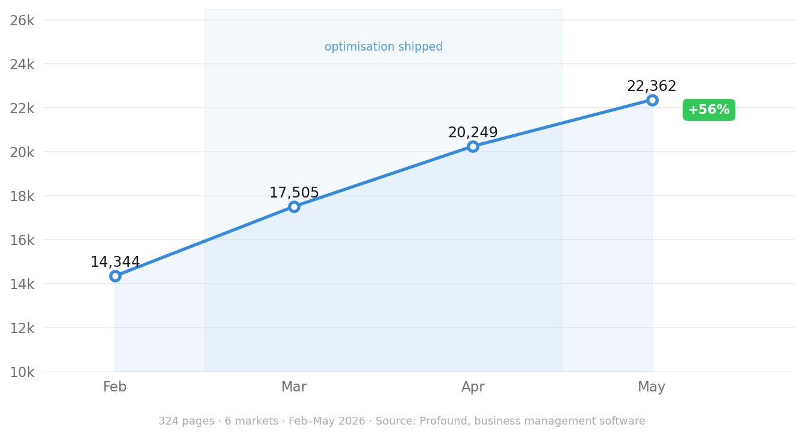
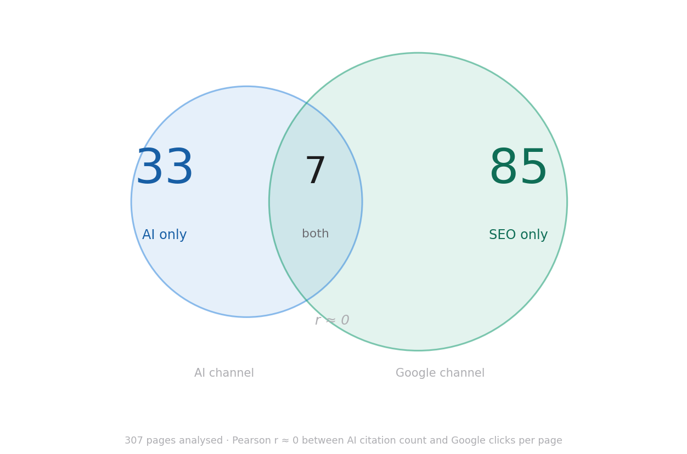
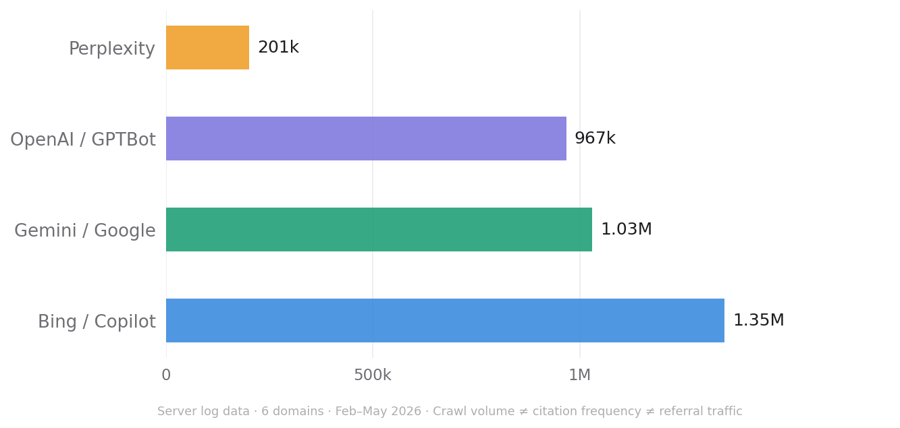

# How businesses appear inside Perplexity and ChatGPT answers
 
For twenty years, the question was "where do we rank?" The answer was a position on a page, and a position bought a click. That model is quietly breaking. When a buyer asks ChatGPT for "the best applicant tracking systems for a 200-person company" or asks Perplexity to compare two vendors, there is no page of blue links to win. There is a synthesised answer, and a short list of sources the engine chose to credit. Your brand is either inside that answer or it is invisible.
 
The mechanics that decide this are not Google's, and they are not a mystery. Here is how the two engines actually build an answer, why they disagree about who deserves a citation, and what that means for the work.
 
## The pipeline both engines share
 
Underneath the branding, ChatGPT search and Perplexity run the same four-stage process, a form of retrieval-augmented generation (RAG):
 
1. **Retrieve** — pull a set of candidate pages relevant to the query from a search index.
2. **Rank** — score those candidates for relevance, structure and authority.
3. **Extract** — try to pull a clean, attributable fact from the top candidates.
4. **Attribute** — generate the answer and credit the sources behind specific claims.
The single most important consequence sits between stages one and four: **being retrieved is not being cited.** An AirOps analysis of roughly 550,000 pages across 15,000 prompts found ChatGPT cites only about 15% of the pages it retrieves. The other 85% are pulled in, read, and discarded without ever surfacing. Your page can be indexed, relevant and retrieved, and still lose the citation to a source the model found easier to extract from or more confident to attribute.
 
This is why classic ranking and AI citation are different games. The most common failure point is not discovery; it is extraction. The engine finds you but cannot lift a clean answer from your page.
 
## How ChatGPT chooses
 
ChatGPT operates on two layers. The base layer is its training data — large, static, and fixed until the next model update. You cannot optimise into it retroactively. The layer that matters for day-to-day visibility is the **retrieval layer**, which is Bing-powered and triggered primarily by commercial-intent queries: anything carrying terms like "reviews", "comparison", "best", "alternatives" or a current year.
 
Two features define its behaviour. First, **Bing indexation is effectively a prerequisite** — if Bing cannot see you, the retrieval layer cannot reach you. Second, ChatGPT is risk-averse about attribution. SE Ranking data from late 2025 describes a "trust cliff": sites with more than 32,000 referring domains were roughly 3.5x more likely to be cited than sites under 200. In Google, moderate authority could still win a long-tail ranking on relevance alone. In ChatGPT, the link graph behaves less like a ranking factor and more like a credibility gate — the model reaches for sources it can cite with confidence, and typically credits only a handful per answer.
 
## How Perplexity chooses
 
Perplexity is built differently. Rather than selectively browsing, it runs a **real-time web search for nearly every query** and treats citation as mandatory — every claim links out.
 
It also classifies the query before retrieving. A factual query, a comparative query ("X vs Y"), a procedural query ("how to…") and an opinion query each trigger a different retrieval strategy, which is why a page that wins a comparison query may never appear for a how-to. Candidates come from two places: Perplexity's own crawler, which prioritises high-citation pages and refreshes them every 24–72 hours, and the Bing index as a fallback for long-tail queries. Those candidates then pass through a multi-layer reranking system that, in independent analyses, leans noticeably toward **earned media and Tier-1 publications** rather than commercial pages. Freshness is weighted heavily throughout — stale content loses ground fast.
 
The practical reading: Perplexity rewards external authority and structured, current content, and it will not cite what its crawler (PerplexityBot) is blocked from reading.
 
## Why the two disagree about you
 
Because the selection criteria differ, the same brand can be loud on one engine and silent on the other. A 2026 study of 34,234 AI responses found a striking gap in how often the engines name brands at all: ChatGPT cited brands around 0.59% of the time, while Perplexity sat near 13% — a roughly 20x difference in brand-citation behaviour. ChatGPT tends to answer in general terms and cite cautiously; Perplexity names sources liberally.
 
We see the downstream version of this in client data. Across an anonymised B2B SaaS programme — 324 published pages spanning six markets, tracked February to May 2026 — AI citations grew **+56%** over the quarter as optimised content shipped.
 

*Citations per month, 324 pages across 6 markets, Feb–May 2026. Optimisation shipped Mar–Apr. Source: Profound, business management software category.*
 
But the correlation between a page's AI performance and its Google performance was **near zero**. Of about 300 pages analysed, 33 were winning in AI but not Google, 85 in Google but not AI, and only 7 were strong in both. AI answers and search results were, in effect, reaching different audiences through different machinery. The lesson: stop treating one as a proxy for the other and measure them separately.
 

*Of 307 pages analysed, only 7 performed strongly in both channels. Pearson r ≈ 0 between AI citation count and Google clicks per page.*
 
One more distinction worth internalising. AI crawlers fetched those six sites about **3.55 million times** in the window — Microsoft/Bing-and-Copilot ~1.35M, Google/Gemini ~1.03M, OpenAI/GPTBot ~967k, Perplexity ~201k.
 

*Server log data across 6 domains, Feb–May 2026. Crawl volume ≠ citation frequency ≠ referral traffic — each requires separate measurement.*
 
Heavy crawling. Yet actual referral visits from those engines stayed tiny, because they rarely pass a referrer. **Crawls, citations and clicks are three different things.** Conflating them is the fastest way to misread your own results.
 
## What this means for the work
 
The mechanics point to a fairly specific playbook for B2B SaaS teams.
 
**Make extraction effortless.** The model has to lift a clean, attributable claim from your page. Front-load the direct answer in the first one or two sentences of each section. Raise fact density — specific numbers, named tools, dates. Use descriptive headings, comparison tables and modular sections instead of long narrative. Write as if answering one question per block, not composing an essay.
 
**Earn entry, not just relevance.** ChatGPT's trust cliff and Perplexity's reranker both reward authority. For Perplexity especially, that means earned media and third-party mentions, not only your own pages. Entity clarity matters too: the engine should understand what you do, who you serve and which category you own before it will confidently name you.
 
**Let the right bots in, and check Bing.** Confirm GPTBot / OAI-SearchBot and PerplexityBot can crawl and render your main content, and confirm you are indexed in Bing — it underpins retrieval for both engines. A blocked crawler is a silent way to disqualify yourself.
 
**Pick the formats that actually get cited.** Comparison pages, original data and pricing/decision content consistently outperform top-of-funnel "what is" guides for AI citations. In the client programme above, the single biggest gainer was a head-to-head software comparison page that added more than 2,700 monthly citations on its own.
 
**Keep it fresh, and measure the right layer.** Both engines favour recency, Perplexity aggressively so. And because crawls, citations and clicks diverge, track citation share and sentiment as their own metric rather than inferring AI visibility from organic traffic. In our data, citation volume rose 56% while sentiment held flat at roughly 64% positive — more answers, same tone, which is exactly the kind of thing you only learn by measuring it directly.
 
## The short version
 
Ranking earns a position. Citation earns a sentence inside the answer a buyer actually reads. ChatGPT gets there through a Bing-backed retrieval layer and a high authority bar; Perplexity through real-time search, query classification and a bias toward earned media. Both reward content that is structured, factual, fresh and easy to attribute — and both will ignore you if the crawler can't read you or the model can't extract you. The brands that win the next few years of AI search are not the ones with the biggest content libraries. They are the ones built to be quoted
